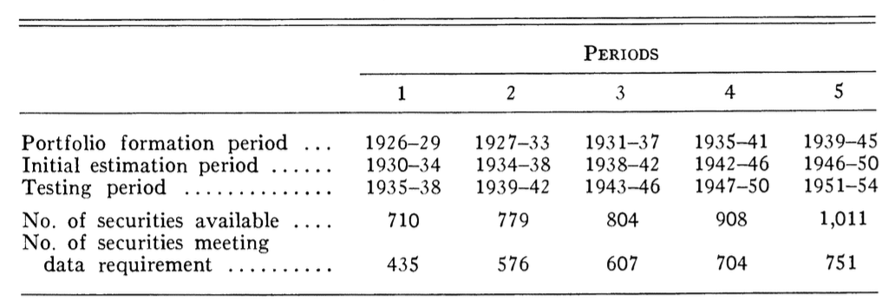

# 金融实证研究论文模型R代码重现
rokia.org  
2016-05-10  

----

这篇文章是给WISERclub同学的一个交流会的内容，主要是介绍如何用Base R实现Fama&MacBeth(1973)这篇论文的模型实现。这次交流来源于一个学生的提问，我发现这个问题比较综合，使用的方法在金融实证文章中也比较有代表，所以总结出来一起分享。

选择这个topic的主要理由如下：

- 论文使用股票交易数据，数据获取容易

- 论文中模型逻辑复杂，回归中自变量的计算过程复杂

- 涉及多张表的数据动态生成与交叉关联应用

- 涉及移动回归，回归中使用的数据时间窗是滚动的

- 涉及分组回归且需提取、计算回归系数及残差的标准差

- 要将n个步骤的回归结果汇总到一个表，且需体现不同的回归id

----

## 问题描述


这篇论文主要要做的事情概括来说是：

- 构造组合收益率并对组合前一期beta值和组合前一期回归残差的标准差进行回归，然后进行t检验。

详细要求参考论文。



## 算法描述

- 第一步：对每个period的 Portfolio formation period(pplist)的所有股票进行回归（RET～EWRTED）（reg.pp），将回归系数从小到大排列，根据回归系数大小，将所有股票等分为20组。

- 第二步：对每个period的在第一步分组的股票进行跟踪。在Testing period(**tplist**)周期中**逐月**对每组股票进行回归分析（AVG_RET_bygroup～BETA+SD_resid）(reg.3)。

- 2.1 计算因变量：提取pplist每组股票的代码清单，然后根据代码清单在**tplist**中提取对应期间(**逐月**)的股票数据。分组计算RET的均值AVG_RET_bygroup。

- 2.2 计算自变量：提取pplist每组股票的代码清单，然后根据代码清单在**iplist**中提取对应期间（**开始5年**）的股票数据。分股票进行回归（RET～EWRTED）(reg.2)，将回归结果的beta以及sd_resi分组计算均值。

- 第三步，将所有period的第一步、第二步的工作中计算的回归结果汇总到一个数据集。

## 代码设计

- 构建主框架


```r
pplist<-list(c(1926:1929),c(1927:1933),c(1931:1937),
             c(1936:1941),c(1939:1945),c(1943:1949),
             c(1947:1953),c(1951:1957),c(1955:1961))

iplist<-list(c(1930:1934),c(1934:1938),c(1938:1942),
             c(1942:1946),c(1946:1950),c(1950:1954),
             c(1954:1958),c(1958:1962),c(1962:1966))

tplist<-list(c(1935:1938),c(1939:1942),c(1943:1946),
             c(1947:1950),c(1951:1954),c(1955:1958),
             c(1959:1962),c(1963:1966),c(1967:1968))
```

## 绕坑(Cont'd)

- 主体框架


```r
#Step one:creat all portfolio groups
for (i in 1:length(pplist))
  reg.pp(pplist[[i]])
#return df.step1
#Step two:regression 
for (i in 1:length(tplist))
  ml.tp<-monthlist(tplist[[i]])
    for (j in 1:length(ml.tp))
    reg.3(i,j)
#return  df.final  
```


## 绕坑(Cont'd)

- 将sas数据集导入到r


```r
#stat transfer 
#haven::read_sas
#foreign::read.ssd
#sas7bdat::read.sas7dbat
```


- [参考《数据分析》课件第四章](https://github.com/zhichaoluo/DataAnalysis/blob/master/chapter04.pdf)

## 绕坑(Cont'd)

- 导入到R后发现，DATE：－12417...


```r
df$DATE<-as.Date(df$DATE, origin="1970-01-01")
#自己挖了一个坑，跳进去却浑然不知道
```

## 绕坑(Cont'd)

- pplist iplist tplist同步问题


```r
calcultY<-function(i,j){
  a<-pplist[[i]]
  p<-paste(a[1],a[length(a)],sep="~")
  ds.x<-subset(df2,YEAR==substr(ml.tp[j],1,4) &
              MONTH==as.numeric(substr(ml.tp[j],5,6)))
  ds.y<-subset(df.step1,pp==p,select=c(PERMNO,group))
  df.xy<-merge(ds.x,ds.y,by="PERMNO",all.x=TRUE)
#...
}
```


## 绕坑(Cont'd)

- 分组回归

- 参考[分组回归的几种方法](http://rokia.org/?p=499)


```r
lm.1<-lmList(RET ~ EWRETD | PERMNO , data=df.t)
beta<-coef(lm.1)
#注意要判断每组obs的数量是否满足回归方程最少要求
```

## 绕坑(Cont'd)

- 如何提取分组回归的beta系数和残差的标准差

```r
beta<-coef(lm.1)
sd_resid<-lapply(1:length(lm.2),
                   function(x)
                     sd(lm.2[[x]]$residuals) )
#如何将提出出来的结果合并到一个数据集
   sd_resid<-do.call(rbind,sd_resid)
   sd_resid<-data.frame(sd_resid,labels(lm.2))
```


## 绕坑(Cont'd)

- 如何将回归系数排序后等分20组

```r
 x<-seq(from=0,to=nrow(beta),
        by=ceiling(nrow(beta)/20))[2:20]
  x<-c(x,nrow(beta))
  beta$group<-cut(1:nrow(beta), 
                  c(0,x),labels = paste0("g",1:20))
  beta$pp<-paste(timeRange[1],
              timeRange[length(timeRange)],sep="~")
```


## 绕坑(Cont'd)

- 如何逐月滚动提取横截面数据进行回归


```r
 ml.ip<-monthlist(iplist[[i]])
  st<-as.Date(paste0(ml.ip[j],"01"),"%Y%m%d")
  et<-st+months(60)
  ds.x<-subset(df2,DATE>=st & DATE<=et)
```

## 绕坑(Cont'd)

- 如何从多张表中提取所需的回归数据


```r
 a<-pplist[[i]]
  p<-paste(a[1],a[length(a)],sep="~")
  ds.x<-subset(df2,YEAR==substr(ml.tp[j],1,4) &
              MONTH==as.numeric(substr(ml.tp[j],5,6)))
  ds.y<-subset(df.step1,pp==p,select=c(PERMNO,group))
  df.xy<-merge(ds.x,ds.y,by="PERMNO",all.x=TRUE)
```


## 绕坑(Cont'd)

- 如何标记存储回归结果id


```r
 beta$pp<-paste(timeRange[1],
              timeRange[length(timeRange)],sep="~")
```

## 绕坑(Cont'd)

- 如何将所有循环的结果保存在一个数据集中

```r
    df.final[[tpid]]<<-res.lm3
```


## 绕坑(Cont'd)

- 如何处理报错问题（必须考虑到主要可能的错误）


```r
#First type check
clear.reg<-function(df,n){
  #make sure each regression has at least n obs
  d<-df %>% group_by(PERMNO)%>% summarise(nr=n())
  c<-subset(d,nr>=n,select=c(PERMNO,nr))
  df<-merge(df,c,by="PERMNO")
}
# Second type check
  if (nrow(y)==0 | nrow(x) == 0 )
    {return(print(paste0(ml.tp[j],
   "test without data!"))) } 
```


## 总结

- 这是一个综合的练习

- 需要扎实的基本功训练

- 思路的上层建筑决定代码效率

- 独立协同完成

- 不要放过每一个细节

- 极致的工匠精神是我们都欠缺的
